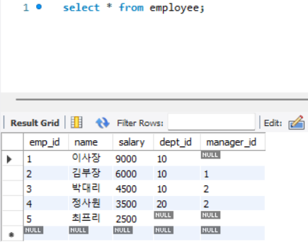

# 01. 조인의 기본과 이해

# 1. 조인의 정의와 필요성

      **조인이란**?

데이터베이스에서 **두 개 이상의 테이블을 연결**하여 하나의 테이블로 만드는 것.

- **사용 이유:** 데이터베이스는 정규화를 통해 테이블을 분리하여 저장함. 이를 다시 합쳐서 사용자에게 보여줄 때 조인이 필요함.
    - 데이터 중복 최소화
    - 데이터 일관성 유지
    
    참고: NoSQL(MongoDB)과의 차이
    
    - MongoDB는 `lookup`이라는 쿼리로 조인을 흉내 낼 수 있음.
    - 하지만 관계형 데이터베이스(RDBMS)보다 성능이 현저히 떨어짐.
    - 따라서 **조인 연산이 많은 서비스라면 처음부터 관계형 DB를 선택**하는 것이 유리함.

---

# 2. 조인의 종류

### 예시용 테이블

### 2.1. 결과 범위에 따른 분류

**1. Inner Join (내부 조인)**

- **개념:** 두 테이블의 조인 조건이 **일치하는 행만** 반환 (교집합)
- **특징:** 어느 한쪽에라도 데이터가 없으면 결과에서 제외됨

**2. Outer Join (외부 조인)**

- **개념:** 매칭되는 데이터가 없어도, **기준이 되는 테이블의 데이터는 무조건 남기는** 방식.
- **종류:**
    - **Left Outer Join:** 왼쪽 테이블 기준. 오른쪽 테이블에 매칭되는 값이 없으면 `NULL`로 채움
        
        
        
    - **Right Outer Join:** 오른쪽 테이블 기준
        
        
        
    - **Full Outer Join:** 양쪽 모두 기준 (MySQL은 미지원하므로 `UNION`으로 대체하여 구현)
    
    
    

**3. Cross Join (교차 조인)**

- **개념:** 조인 조건 없이 두 테이블의 **모든 가능한 조합**을 반환 (카타시안 곱)
- **결과:** A테이블(10행) * B테이블(5행) = **50행**
- **주의:** 의도치 않게 사용하면 데이터 폭증으로 인한 **DB 성능 장애의 주범**이 됨

**4. Self Join (셀프 조인)**

- **개념:** 물리적으로 동일한 테이블을 서로 다른 별칭(Alias)을 주어 조인하는 방식
- **용도:** 계층형 구조(조직도, 카테고리 등)에서 자신의 상위/하위 데이터를 찾을 때 사용

---

### 2.2. 매칭 조건에 따른 분류

조인 조건절(`ON`)에 어떤 연산자를 쓰느냐에 따른 분류

**1. Equi Join (동등 조인)**

- 조건이 일치(`=`)하는 경우
- 대부분의 조인이 이에 해당하며, 가장 성능이 좋음.

**2. Non-Equi Join (비동등 조인)**

- 조건이 일치하지 않고 범위(`BETWEEN`)나 부등호(`>`, `<`)를 사용하는 경우.
- 참고!
    
    Non-Equi Join을 사용할 때는 해시 조인(Hash Join) 알고리즘을 사용할 수 없음.
    
    따라서 대용량 처리 시 성능 최적화에 각별한 주의가 필요함.
    

---

### 👨‍💻 작성자 코멘트 (Next Step)

여기까지 조인의 기본 개념과 종류를 정리했음.

다음 섹션에서는 실제 DB 엔진 내부에서 조인이 어떻게 돌아가는지 **[3. 조인 수행 알고리즘 (NL, Merge, Hash)]**에 대해 파헤쳐 보자.