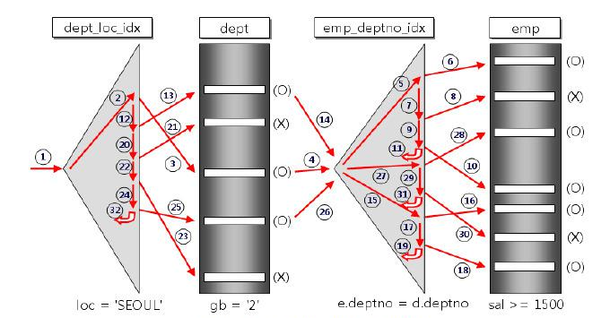
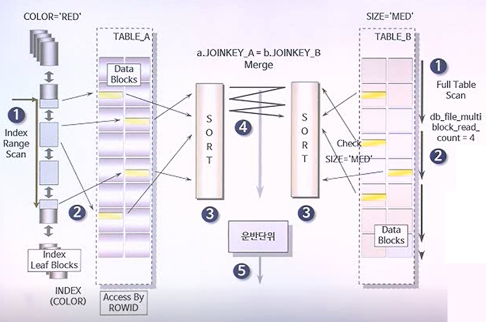

# 02. 조인의 원리

앞서 설명한 조인은 어떤 결과물을 만들까에 대한 이야기였다면 이 파트는 DB 엔진이 내부적으로 어떻게 데이터를 짝지을까에 대한 이야기

# 1. 조인 원리

SQL을 작성해서 실행하면 데이터베이스의 Optimizer는 데이터의 크기, 인덱스 유무 등을 따져서 가장 빠를 것 같은 알고리즘을 선택해 수행한다. 대표적인 3가지 방식이 있다.

### 1.1. Nested Loop Join

이중 반복문(for loop)을 돌면서 하나씩 찾는 방식

가장 기본적이고, 전통적인 조인 방식이다.

- DrivingTable : Join을 할 때 먼저 액세스 되는 테이블
- DrivenTable : 나중에 액세스 되는 테이블

**동작 원리:**

1. 선행 테이블(Driving Table, A)에서 행을 하나 읽는다.
2. 그 값을 가지고 후행 테이블(Driven Table, B)로 가서 일치하는 데이터를 찾는다. 
3. 이 과정을 A 테이블의 모든 행에 대해 반복한다.



- Pseudo-code

```c
for (Row outer : DrivingTable) {      // 외부 루프
    for (Row inner : DrivenTable) {   // 내부 루프
        if (outer.id == inner.id) {
            emit(outer, inner);       // 결과 반환
        }
    }
}
```

특징 :

**1. Driven 테이블 인덱스 필요**

- 안쪽 테이블에 인덱스가 없다면 루프를 돌때마다 풀 스캔을 해야함.

**2. 랜덤 액세스 위주의 수행**

- 후행 테이블의 인덱스를 타고 실제 데이터를 찾으러 갈 때, 디스크 헤드가 여기저기 이동하는 **랜덤 I/O**가 발생합니다.
- 대용량 데이터를 처리할 때는 처리 속도가 급격히 저하

**3. 구동 테이블(Driving Table)의 크기가 성능을 좌우**

- 루프를 도는 순서에 따라 전체 반복 횟수가 결정
- 전체 데이터 양이 같더라도, 작은 테이블이 선행 테이블이 되어야 성능이 좋음

# 1.2. Sort Merge Join

양쪽 테이블을 정렬한 뒤,  차례로 병합하는 방식

### 1. 언제 사용하는가?

1. **연결 고리(Join Key)에 인덱스가 전혀 없는 경우**
2. **대용량의 자료**를 조인해야 하는데, 인덱스를 타는 랜덤 액세스 부하가 너무 심한 경우
3. **범위 검색 조건**(`<`, `>`, `<=`, `>=`)으로 조인해야 하는 경우

### 2. 동작 방식

Sort Merge Join은 1. 읽기(Access) → 2. 정렬(Sort) → 3. 병합(Merge)의 3단계로 진행

### 예시 쿼리

```sql
SELECT /*+ USE_MERGE(A B) */ A.Color, B.Size
FROM TABLE_A A, TABLE_B B
WHERE A.joinkey_a = B.joinkey_b   -- 1. 조인 키에 인덱스 없음 (SMJ 선택 이유)
  AND A.color = 'RED'             -- 2. 인덱스 있음 (Range Scan)
  AND B.size = 'MED';             -- 3. 인덱스 없음 (Full Scan)
```

### 수행 과정



1. **데이터 액세스 (Access)**
    - **Table A:** `COLOR = 'RED'` 조건을 만족하는 데이터를 읽기 (인덱스가 있다면 Index Range Scan)
    - **Table B:** `SIZE = 'MED'` 조건을 만족하는 데이터를 읽기 (인덱스가 없다면 Full Table Scan)
    - *특징:* 양쪽 테이블을 동시에(혹은 독립적으로) 읽음
2. **정렬 (Sort)**
    - 읽어온 데이터를 조인 키(`joinkey_a`, `joinkey_b`)를 기준으로 별도의 메모리 공간에서 **정렬**
3. **병합 (Merge)**
    - 정렬이 완료된 두 결과 집합을 차례로 스캔하면서 연결 고리가 맞는 행을 찾아 조인하고 리턴

# 1.3. Hash Join

### 1. 정의 및 특징

- **개념:** 조인될 두 테이블 중 하나를 해시 테이블로 선정하여 메모리에 올리고, 해시 알고리즘을 통해 매치되는 값을 찾는 방식입니다.
- **조건:**
    - 비용 기반 옵티마이저(CBO)를 사용할 때만 선택
    - 반드시 **동등 조인(`=`)** 조건(해시 함수 특성상 범위 검색 불가)
- **목적:** 주로 **대용량 데이터**를 조인해야 하거나, 인덱스 효율이 떨어질 때 사용

### 2. 언제 사용하는가?

1. **인덱스가 없을 때:** 조인 컬럼에 적당한 인덱스가 없어 NL Join을 쓸 수 없을 때
2. **랜덤 액세스 부하:** 인덱스는 있지만, 건수가 너무 많아 랜덤 액세스(Random Access) 부하가 심할 때
3. **정렬 비용 부담:** Sort Merge Join을 하기에는 두 테이블이 너무 커서 정렬(Sort) 부하가 심할 때
4. **대용량 배치 처리:** 수행 빈도는 낮지만, 한 번 수행할 때 오래 걸리는 대용량 테이블을 조인할 때

### 3. 수행 과정

Hash Join은 Build Input(작은 집합)과 Probe Input(큰 집합)이라는 두 단계


### 1. Build 단계 (해시 테이블 생성)

- 두 테이블 중 더 작은 집합(Build Input)을 읽어 메모리 상의 **Hash Area**에 해시 테이블을 생성
- 조인 키를 해시 함수에 넣어 리턴 받은 **버킷 주소**를 찾아가 데이터를 연결
    - *핵심:* 작은 테이블을 먼저 메모리에 빠르게 빌드하는 것이 중요

### 2. Probe 단계 (탐색 및 조인)

- 반대쪽 큰 집합(Probe Input)을 순차적으로 읽기
- 읽은 데이터의 조인 키를 해시 함수에 넣어, 앞서 만든 해시 테이블에 해당 값이 존재하는지 탐색(Probe)
- 버킷 주소의 체인을 스캔하면서 매칭되는 데이터를 찾아 결과로 반환

## 비교표

| **구분** | **Nested Loop Join** | **Sort Merge Join** | **Hash Join** |
| --- | --- | --- | --- |
| **핵심 원리** | 이중 반복문 + **랜덤 액세스** | **정렬(Sort)** + 스캔 | **해시(Hash)** + 스캔 |
| **속도 결정** | 인덱스 유무 & 랜덤 I/O | 정렬 속도 | 해시 테이블 생성(메모리) 속도 |
| **사용처** | **소량 데이터** (OLTP) | 인덱스 X, **범위 검색** | **대용량 데이터** (분석/배치) |
| **필수 조건** | Driven Table의 인덱스 | - | **동등 조인(`=`)** |
|  |  |  |  |