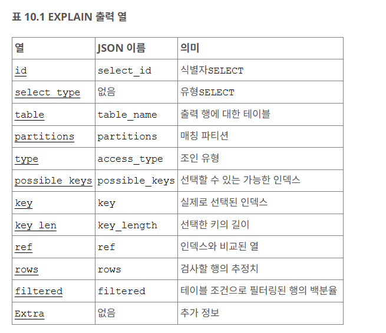

# 04. MySQL 실행계획 분석

공식 api 문서 : [https://dev.mysql.com/doc/refman/8.0/en/explain-output.html#explain-join-types](https://dev.mysql.com/doc/refman/8.0/en/explain-output.html#explain-join-types)

[https://dev.mysql.com/doc/refman/8.0/en/explain.html#explain-execution-plan](https://dev.mysql.com/doc/refman/8.0/en/explain.html#explain-execution-plan)

예시 블로그 : [https://zzang9ha.tistory.com/436#google_vignette](https://zzang9ha.tistory.com/436#google_vignette)

## 1. EXPLAIN 개요 및 사용법

### 기본 개념

- **역할**: `SELECT`, `DELETE`, `INSERT`, `REPLACE`, `UPDATE` 문이 어떻게 실행되는지 정보를 제공합니다.
- **순서**: 출력에 나열된 테이블 순서는 MySQL이 처리(읽는) 순서입니다.

### 실행 방법 & 포맷

```sql
- 1. 기본 실행 (Table 포맷)
EXPLAIN SELECT * FROM tbl_name;
-- 2. 트리 포맷
EXPLAIN FORMAT=TREE SELECT * FROM tbl_name;
-- 3. JSON 포맷
EXPLAIN FORMAT=JSON SELECT * FROM tbl_name;
-- 4. 실제 실행 분석 (MySQL 8.0.18+)
-- 쿼리를 진짜 실행해보고 예상 비용과 실제 소요 시간을 비교
EXPLAIN ANALYZE SELECT * FROM tbl_name;
```

---

## 실행 계획 컬럼



---

## 1. id

쿼리 내의 **SELECT 문의 순차 번호**입니다.

- **의미:** 쿼리가 실행되는 순서를 식별합니다.
- **특이사항:**
    - 행이 다른 행들의 **UNION 결과**를 참조하는 경우 값이 `NULL`일 수 있습니다.
    - 이 경우 `table` 컬럼에는 `<unionM,N>`처럼 표시되어 id가 `M`과 `N`인 행의 합집합임을 나타냅니다.

---

## 2. select_type

**SELECT 문의 유형**을 나타냅니다.

| **값** | **의미** | **비고** |
| --- | --- | --- |
| **SIMPLE** | 단순 SELECT | UNION이나 서브쿼리를 사용하지 않음. |
| **PRIMARY** | 가장 바깥쪽 SELECT | 서브쿼리가 있을 때 최상위 쿼리. |
| **UNION** | UNION의 두 번째 이후 SELECT | UNION으로 결합된 쿼리 중 첫 번째 이후의 것들. |
| **DEPENDENT UNION** | 의존적 UNION | 외부 쿼리에 의존성을 가진 UNION. |
| **UNION RESULT** | UNION 결과 | UNION의 결과 집합. |
| **SUBQUERY** | 서브쿼리 | 서브쿼리의 첫 번째 SELECT. |
| **DEPENDENT SUBQUERY** | 의존적 서브쿼리 | 외부 쿼리에 의존성을 가진 서브쿼리. |
| **DERIVED** | 파생 테이블 | FROM 절의 서브쿼리 (Derived Table). |
| **MATERIALIZED** | 구체화된 서브쿼리 | 성능을 위해 임시 테이블로 구체화된 서브쿼리. |

---

## 3. table (Table Name)

출력 행이 참조하고 있는 **테이블의 이름**입니다.

- **특수 표기:**
    - `<unionM,N>`: id가 M과 N인 행의 **합집합(Union)** 결과.
    - `<derivedN>`: id가 N인 행의 **파생 테이블(Derived table)** 결과 (FROM 절 서브쿼리 등).
    - `<subqueryN>`: id가 N인 행의 **구체화된 서브쿼리(Materialized subquery)** 결과.

---

## 4. partitions (Matching Partitions)

쿼리가 레코드를 매칭시킬 **파티션** 정보입니다.

- **특이사항:** 파티셔닝되지 않은 테이블인 경우 값은 `NULL`입니다.

---

## 5. type (Join Type)

테이블을 어떻게 읽는지 보여주는 **조인 유형(Join Type)**입니다.

| **순위** | **유형 (Value)** | **설명 (Meaning)** |
| --- | --- | --- |
| 1 | **system** | 테이블에 행이 하나뿐임 (시스템 테이블). |
| 2 | **const** | PK/Unique Key로 조회하여 **1건만** 반환됨. 상수 취급. |
| 3 | **eq_ref** | 조인 시 PK/Unique Key로 **1건씩 정확히 매칭**. |
| 4 | **ref** | Non-Unique 인덱스 사용 또는 키의 일부만 사용. |
| 5 | **fulltext** | 전문 검색(Fulltext) 인덱스 사용. |
| 6 | **ref_or_null** | `ref`와 유사하나 `NULL` 값을 추가 검색. |
| 7 | **index_merge** | 인덱스 병합 최적화 사용 (여러 인덱스 동시 사용). |
| 8 | **range** | 인덱스 **범위 검색** (`BETWEEN`, `>`, `<` 등). |
| 9 | **index** | **인덱스 풀 스캔**. 인덱스 전체를 읽음. |
| 10 | **ALL** | **테이블 풀 스캔**. 디스크의 모든 데이터를 읽음. |

---

## 6. possible_keys (Possible Indexes)

MySQL이 행을 찾기 위해 **선택할 수 있는(후보)** 인덱스 목록입니다.

- **주의:** 출력된 테이블 순서와 상관없이 독립적으로 표시되므로, 실제로는 사용되지 않을 수도 있습니다.
- **NULL인 경우:** 관련 인덱스가 없다는 뜻입니다. `WHERE` 절을 확인하여 인덱스 생성을 고려해야 합니다.

---

## 7. key (Actual Index)

MySQL이 **실제로 사용하기로 결정한** 인덱스(Key)입니다.

- **특이사항:**
    - `possible_keys`에 없던 인덱스가 `key`에 나올 수도 있습니다 (커버링 인덱스 사용 시).
    - 값이 `NULL`이면 인덱스를 사용하지 못했다는 뜻입니다.
- **강제 적용:** `FORCE INDEX`, `USE INDEX`, `IGNORE INDEX` 등을 사용하여 옵티마이저에 힌트를 줄 수 있습니다.

---

## 8. key_len

MySQL이 사용하기로 결정한 **키의 길이**

- **활용:** 다중 컬럼 인덱스(복합 인덱스)에서 **몇 개의 컬럼(부분)까지 사용했는지** 판단할 수 있습니다.
- **참고:** `key` 컬럼이 `NULL`이면 `key_len`도 `NULL`입니다.

---

## 9. ref

`key` 컬럼에 명시된 인덱스와 **비교되는 대상**이 무엇인지 보여줍니다.

---

## 10. rows

쿼리를 실행하기 위해 **조사해야 할 것으로 예측되는 행의 수**입니다.

- **특징:** InnoDB 테이블의 경우 이 숫자는 추정치이며 정확하지 않을 수 있습니다.
- **해석:** 이 숫자가 줄어들수록 쿼리 성능이 좋다는 것을 의미합니다.

---

## 11. filtered (Filtered Percentage)

테이블 조건에 의해 필터링되고 남은 행의 비율(%)

- **값의 의미:**
    - 최대값 **100**: 필터링되어 버려지는 행이 없음
    - 값이 낮음: 많은 행이 검사되었지만 조건에 맞지 않아 버려짐.
- **계산:** `rows` × `filtered` = **다음 테이블과 조인될 예상 행 수**

---

## 12. Extra

| **메시지 (Value)** | **설명 (Meaning)** |
| --- | --- |
| **Using index** | **커버링 인덱스**. 데이터 파일 접근 없이 인덱스만으로 해결. |
| **Using where** | 스토리지 엔진에서 읽은 후 MySQL 엔진에서 필터링함. |
| **Using index condition** | 인덱스 컨디션 푸시다운(ICP) 사용. 스토리지 엔진에서 미리 필터링. |
| **Select tables optimized away** | `MIN()`, `MAX()` 등을 인덱스로 바로 조회하여 테이블 읽기 생략. |
| **Using filesort** | 인덱스로 정렬을 못 해서 **별도의 정렬 작업** 수행. |
| **Using temporary** | 결과 처리를 위해 **임시 테이블**을 생성함. |
| **Using join buffer** | 조인 버퍼(Block Nested Loop, Hash Join)를 사용함. (인덱스 부족) |
| **Impossible WHERE** | `WHERE` 조건이 항상 `False`임 (결과 없음). |
| **Zero limit** | `LIMIT 0`이 있어 아무 행도 선택되지 않음. |